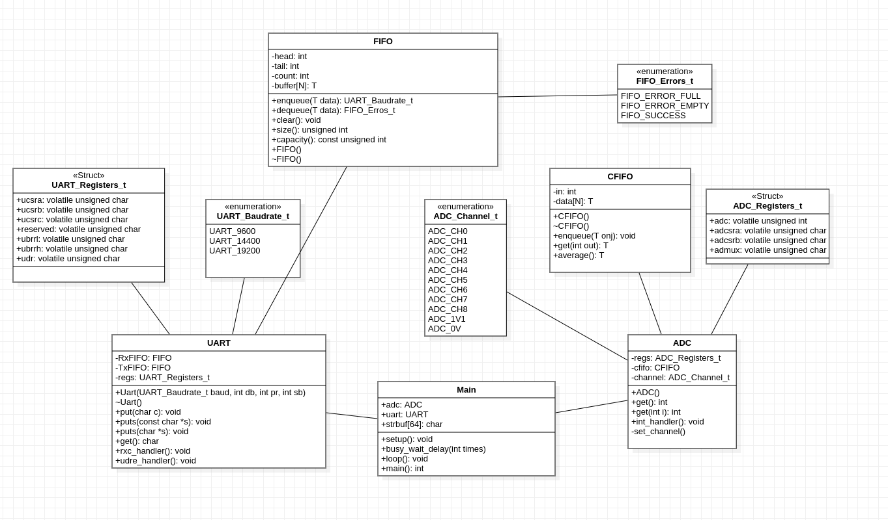

# IFSC STE 2022.2 - Biblioteca para o ATMega328P

Esta é uma biblioteca para uso de componentes do ATMega328P (MCU presente no Arduino Uno) utilizando o GCC. O objetivo deste projeto é estudar e conhecer a MCU AVR em uso e, neste processo, aplicar conceitos de projeto de sistemas embarcados. A linguagem-base da biblioteca é C++, embora alguns trechos de código podem conter sequências C ou em assembly.

# Documentação da Atividade

Esta atividade tem como inuito de realizar a leitura de uma porta análogica das 16 últimas medições em um Conversor Análogico-Digital (ADC) para ataulizar sua média. Assim cada leitura seja necessário imprimir-lá, por meio de uma UART o valor médio atualizado. Para a resolução desta atividade, foi desenvolvido um sistema onde é necessário que uma UART com filas de transmissão (Tx) e recepção (Rx) imprima o valor médio, obtido apartir das 16 últimas medições armazenadas em uma fila circular no ADC.

## UART

Usada para comunicação entre uma placa Arduino(ATMega328P) e um computador ou outros dispositivos. Composta por métodos `put()` para colocar dados na uart e o metódo `get()` para receber o valor. Além de seu construtor e o os tratadores de inturrupção: `rxc_handler()` e `udre_handler()`.

### put()

Enfileira dados na FIFO de Transmissão. Liga a interrupção UDRE.

### get()

Desenfileira dados na FIFO de Recepção e retorna o dado.
### rxc_handler()

Enfileira dados na FIFO de Recepção.
### udre_hanlder()

Desenfileira dados na FIFO de Transmissão e guarda o mesmo no registrador da udr. Desliga a a interrupção UDRE caso não haja nenhum valor na fila da FIFO de transmissão.
## ADC

Usada para Conversão de sinais analógico para digital. Composta por métodos de que recebém os valores Da conversão do ADC: `get()`. E  Além de seu construtor e alocador de canais, `set_channel()`, um  tratador de interrupção: `int_handler()`.

### get()

Retorna o valor médio de todos os valores na fila circular. Caso seja passado um parametro da posição da fila circular, retorna tal valor especificado da fila.

### int_handler()

Enfileira dados na Fila Circular.

### set_channel()

Seta o canal no registrador admux.

## FIFO
Uma estrutura de dados que segue a ideia de: "primeiro a entrar, primeiro a sair" (o primeiro a entrar é o primeiro a sair), um método para organizar a manipulação de uma estrutura de dados (geralmente, especificamente um buffer de dados) onde a entrada mais antiga (primeira), ou "cabeça" da fila, é processado primeiro.

## CFIFO (Fila Circular)

Uma fila circular é uma estrutura de dados que usa um único buffer de tamanho fixo como se estivesse conectado de ponta a ponta.

## Diagrama UML do Sistema

